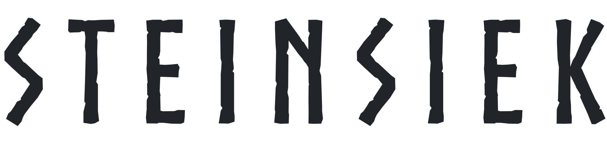
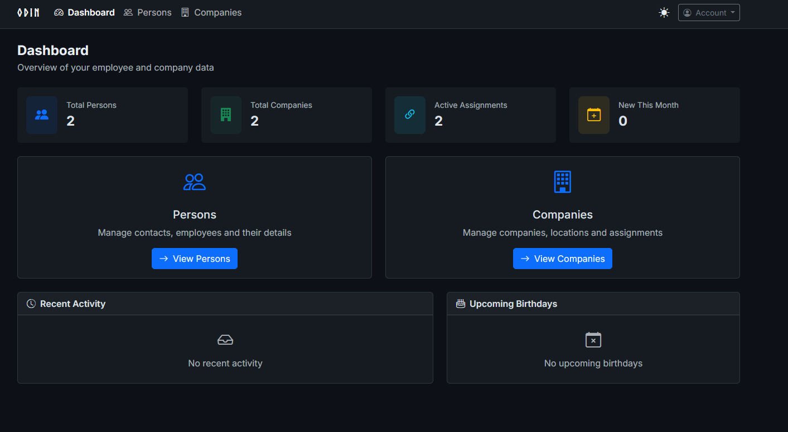
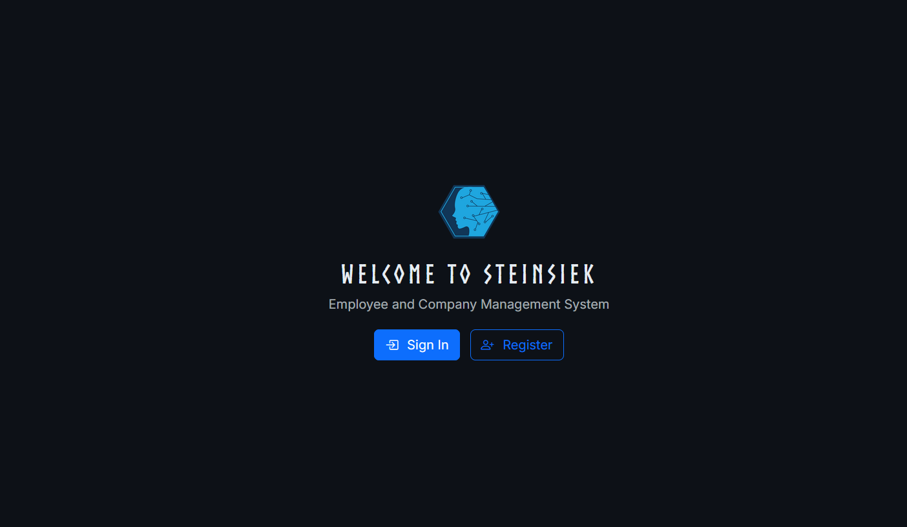
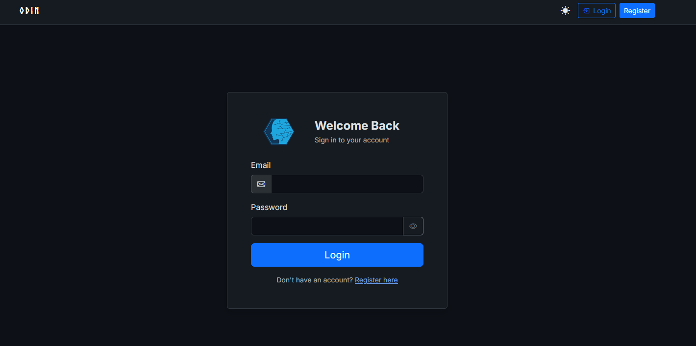
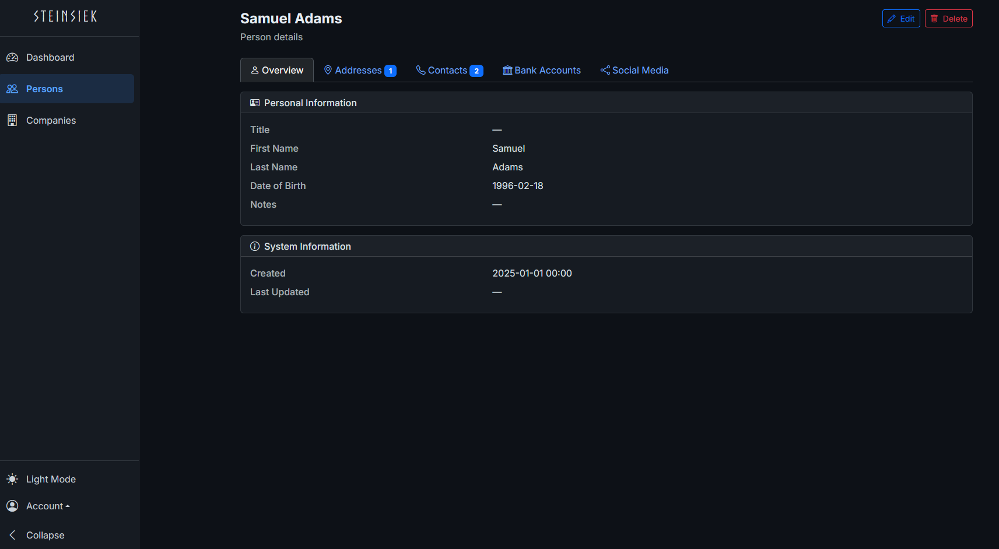
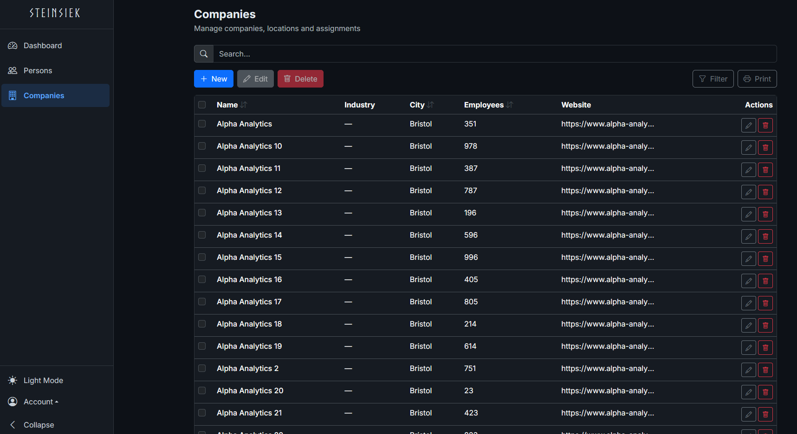

<div align="center">
  <a href="https://github.com/sergej-stk/Steinsiek.Odin">
    
  </a>
  <br>
  
  <br><br>
  <p><strong>Modern Employee and Company Management, built for teams that move fast.</strong></p>

  [](https://github.com/sergej-stk/Steinsiek.Odin/actions/workflows/build.yml)
  [](https://github.com/sergej-stk/Steinsiek.Odin/actions/workflows/test.yml)
  [](https://github.com/sergej-stk/Steinsiek.Odin/actions/workflows/codequality.yml)

  [Documentation](https://odin.sergejsteinsiek.com) · [Report Bug](https://github.com/sergej-stk/Steinsiek.Odin/issues/new?template=bug-report.yml&labels=bug) · [Request Feature](https://github.com/sergej-stk/Steinsiek.Odin/issues/new?template=feature-request.yml&labels=enhancement) · [Changelog](CHANGELOG.md)
</div>

---

## Why Steinsiek?

Steinsiek is a full-stack Employee and Company Management platform powered by .NET 10 and ASP.NET Aspire. Its **Modular Monolith** architecture gives you the clean domain separation of microservices with the operational simplicity of a single deployment. A polished Blazor frontend, a comprehensive REST API, and built-in orchestration mean your team can ship features instead of fighting infrastructure.

## Key Features

- **Modular Monolith Architecture** — Each domain (Auth, Persons, Companies, Core) lives in its own module with dedicated entities, services, and repositories, yet deploys as one unit
- **Person Management** — Full CRUD with detail views, addresses, phone numbers, emails, bank accounts, social media links, and image uploads
- **Company Management** — Full CRUD with locations, employee associations, industry classification, and legal form tracking
- **JWT Authentication & RBAC** — Secure token-based auth with four roles (Admin, Manager, User, ReadOnly) and granular endpoint authorization
- **Interactive Dashboard** — At-a-glance statistics, recent activity feed, and upcoming birthday notifications
- **Dark & Light Mode** — One-click theme toggle with CSS Custom Properties and Bootstrap 5
- **Bilingual UI** — Full English and German localization via .resx resource files
- **Audit Trail** — Automatic change tracking for every create, update, and delete across all entities
- **Server-Side Pagination** — Filterable, sortable, paginated lists with URL-persisted state
- **Aspire Orchestration** — PostgreSQL, Redis, API, and Web frontend wired together with service discovery and health monitoring
- **Scalar API Docs** — Beautiful, interactive API documentation out of the box

## Preview



<table>
<tr>
<td width="50%"></td>
<td width="50%"></td>
</tr>
<tr>
<td align="center"><sub>Landing Page</sub></td>
<td align="center"><sub>Login</sub></td>
</tr>
<tr>
<td width="50%"></td>
<td width="50%"></td>
</tr>
<tr>
<td align="center"><sub>Person Detail</sub></td>
<td align="center"><sub>Company List</sub></td>
</tr>
</table>

## Tech Stack

| Category | Technology |
|----------|------------|
| Framework | .NET 10, C# 13 |
| Frontend | Blazor Server, Bootstrap 5.3, Bootstrap Icons |
| Database | PostgreSQL, EF Core 10 |
| Orchestration | ASP.NET Aspire |
| Logging | Serilog |
| API Docs | Scalar |
| Authentication | JWT Bearer, BCrypt |
| Caching | Redis |
| Testing | MSTest 4.0 |

## Quick Start

**Prerequisites:** [.NET 10 SDK](https://dotnet.microsoft.com/download) and an IDE of your choice.

```bash
# Clone with submodules
git clone --recurse-submodules https://github.com/sergej-stk/Steinsiek.Odin.git
cd Steinsiek.Odin

# Build
dotnet build

# Run via Aspire
dotnet run --project src/Steinsiek.Odin.AppHost
```

After startup the **Aspire Dashboard** URL appears in the console. From there you can access the Web frontend and API.

**Demo credentials:**
```
Email:    demo@steinsiek.de
Password: Demo123!
```

**API documentation:** `https://localhost:{port}/scalar/v1`

## Project Structure

```
Steinsiek.Odin/                              # Super-repo (orchestration + CI/CD)
├── src/
│   ├── Steinsiek.Odin.AppHost/              # Aspire orchestration
│   ├── Steinsiek.Odin.ServiceDefaults/      # Shared Aspire configuration
│   ├── Steinsiek.Odin.API/                  # [submodule] Backend API + modules + tests
│   ├── Steinsiek.Odin.Web/                  # [submodule] Blazor Web frontend
│   └── Steinsiek.Odin.Shared/               # [submodule] DTOs & shared contracts
├── assets/                                   # Logo, screenshots, branding
├── docs/                                     # Documentation site
└── scripts/                                  # Build & generation scripts
```

## Documentation

Each submodule has its own comprehensive technical README:

| Repository | Description |
|------------|-------------|
| [Steinsiek.Odin.API](https://github.com/sergej-stk/Steinsiek.Odin.API) | Backend architecture, module structure, API endpoints, database schema, testing |
| [Steinsiek.Odin.Web](https://github.com/sergej-stk/Steinsiek.Odin.Web) | Frontend architecture, shared components, authentication flow, theming, localization |
| [Steinsiek.Odin.Shared](https://github.com/sergej-stk/Steinsiek.Odin.Shared) | DTO contracts, pagination patterns, validation rules, module contents |

## Contributing

Contributions are welcome! Please read the [Contributing Guidelines](CONTRIBUTING.md) before opening issues or submitting pull requests.

<a href="https://github.com/sergej-stk/Steinsiek.Odin/graphs/contributors">
  
</a>

## Security

To report a security vulnerability, please use [GitHub's private vulnerability reporting](https://github.com/sergej-stk/Steinsiek.Odin/security/advisories/new). See [SECURITY.md](SECURITY.md) for details.

## License

This project is proprietary software. See [LICENSE.txt](LICENSE.txt) for details.
